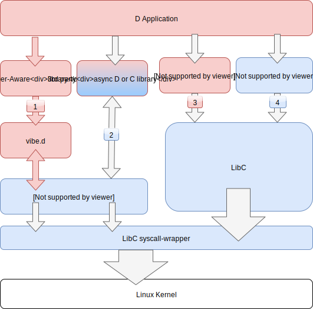

# D Fiber scheduler project

## Intro

The goal of the project is to transparently enable the model of "pseudosynchronous" I/O (popularized by Go language) for all of D libraries and even most of C libraries. It combines the scalability of asynchronous I/O with simple programming model of synchronous I/O.

In short, there are roughly 3 ways (glossing over OS specific abilities) to tackle I/O.

1. Synchronous (blocking) I/O, where a kernel will block a thread and wake it up once the resource is available. This has the advantage of simple programming model at the expense of hogging a precious OS resource - threads, in addition to an expensive round-trip through the OS kernel to perform a context switch.

2. Explicit asynchronous (async) I/O. Typically involves passing a callback that is triggered on completion. More convenient model builds an algebra of Promise/Future objects on top of callbacks, such objects are then manipulated in a functional way. Lastly async/await extensions to some languages rewrite away the error-prone callback code via code transformation. Scalability comes from the fact that the thread continues on with its work after registering callback, so a single thread may process a multitude of sockets at the same time.

3. Pseudosynchronous (pseudoblocking) I/O, this is built on the green thread (Fiber in D) concept. First it makes fibers cheap, typically by allocating a modest stack size and/or growing it on demand. Secondly the runtime of the language (or the library) takes the burden of the context switch thus making it cheap to go from one green thread to the other. The moment a fiber wants to do a synchronous I/O the runtime will instead do async I/O and transparently switch context to another fiber.

There are oversimplifications in the above introductions. In particular on Linux AIO (Asynchronous I/O) is a separate thing from non-blocking I/O and typically event-loops that implement schemes 2 & 3 noted above would use non-blocking I/O + kernel event system. More on that below.

Go language would be a remarkably popular example of 3rd option - Goroutines are green threads that get scheduled (mapped) to a handful of OS threads in the language runtime.

C# and Dart would be an examples of 2nd option - language extension to tackle explicit asynchronous I/O (and not only I/O). Many other languages follow suit.

## Problem statement

Current situation with I/O in DLang looks roughly like the following diagram. Due to D's ability to call into arbitrary C libraries we have the full Zoo of options without any of the benefits. To be specific we have normal synchronous I/O in std library (std.socket etc.), fiber-based I/O scheduling as an opt-in library, sometimes explicit async I/O of kind in 3rd party C libraries and synchronous I/O in the general mass of C libraries.

The landscape is naturally a wild west, see below 

Specifically note the points of interaction 1-4:
1. Fiber-aware D library talks to vibe.d via special wrappers of most socket operations, this is pseudoblocking model. Note that a library has to depend on vibe.d to benefit + user has to run vibe.d scheduler for it to work.
2. Some 3-rd party library (typically C) provides callback-driven asynchronous API and talks to its own choice of event library/direct syscalls. This still allows a fiber to wait on it without blocking the thread but requires a bit of "interconnect" code.
3. D library may call some libc primitive that does synchronous I/O call, notably hostname resolution in libc is like that. It breaks fiber-aware pseudoblocking model and there is no static checking against it.
4. Finally most 3rd party C client libraries do synchronous I/O calls with the same caveats.

What's important to understand is that all of the above can be mixed and matched (and in fact inevitably will, if we are not careful). To underline the problem:
 - explicit async mixes well with explicit async of the same flavor, badly with any other model. But at least it's an explicit problem that can be solved on per use case basis.
 - pseudoblocking only works if everything is following pseudoblocking model, also explicit async can integrate passably well, any single blocking primitive rapidly degrades pseudoblocking model
- finally blocking I/O is bane of all, it trivially spills through into any other model code with disastrous consequences

The end result is a brittle ecosystem where even if you have a 3rd party "driver" for your database it is likely not compatible with your I/O scheme, and the most widely compatible scheme (blocking I/O) is not scalable. Some libraries have 2 versions - one on top of vibe.d sockets and the other on top of std.socket.

## Solution

This project is attempting a bold approach to solve this problem once and for all:
1. Introduce event loop and green threads as unescapable component initialized at start up or lazily (no separate opt-in library as in vibe.d).
2. Replace the libc syscall wrapper so that any blocking call relying on it (which is next to all) is transparently rewired to go through pseudoblocking runtime. All 3rd party libraries do fiber-aware pseudoblocking I/O automatically.
3. The rest of the libraries that do explicit async I/O stay as their are, their syscall are passed through. In the future we will intercept them as well to re-route to our eventloop, basically emulating the likes of `select`, `poll` and `epoll` in user-space by reusing the same event cache.
4. Finally vibe.d may produce a thin-shelled version that forward all of calls to blocking I/O to reuse our scheduler.

Note: the approach of overriding underlying libc facilities is not something new or uncalled for, e.g. jemalloc does it fitfully to replace default libc memory allocator.
